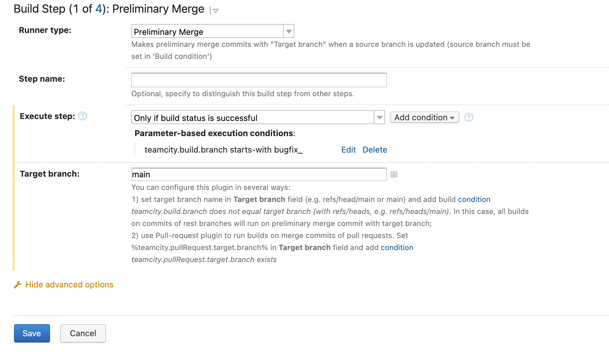
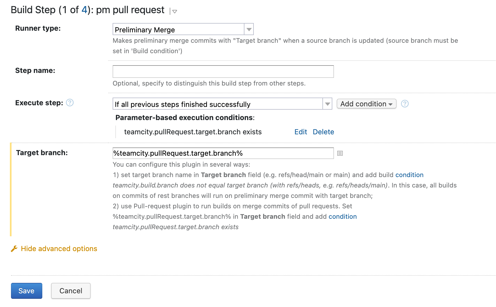

# Preliminary Merge Build Step
## Plugin description

This plugin allows running builds on merge results before the merge was committed. It helps to detect integration problems. 

Merge commit which is created by this build step is not pushed to the remote repository, it exists only on an agent.

There is only one field in the Build Step configuration: **Target branch**.

There are two ways to configure this plugin:

1. If you want to run builds on merge results with any _target_ branch (e.g. main) you should type this one in the **Target branch** field. You can also add build step conditions for any purposes, e.g. do merge only for several branches (like in the screen: run all builds in _bugfix\_*_ branches on merge result with _main_). 
2. Most Git-services don't provide the merge-commits of (Merge|Pull)-requests explicitly or don't recommend using them (e.g. GitHub). So, if you want to run the build on the merge commit you should use [Pull Request plugin](https://www.jetbrains.com/help/teamcity/pull-requests.html) integration. You should type _%teamcity.pullRequest.target.branch%_ into **Target branch** field and add necessary condition: _teamcity.pullRequest.target.branch exists_. 

This plugin also works with several VCS-roots. When _Build Branch_ isn't found it falls back to the ```<default>``` branch. When it exists, preliminary merge commit with target branch creates.

TODO write about Azure DevOps and multiple vcs roots